# benchmark_BatchCorrection
This is the repositories of the code and visualization for my benchmark of the batch correction tools in the scRNA-seq field. Harmony, Seurat V5 integration and BBKNN is used in this study. 
You can find all the code from the "final_pipeline" and the visualization from the "Figure"

 
239T_Jurkat dataset of the first task:
 
support.10xgenomics.com/single-cell-gene-expression/datasets/1.1.0/jurkat
 
support.10xgenomics.com/single-cell-gene-expression/datasets/1.1.0/293t
 
support.10xgenomics.com/single-cell-gene-expression/datasets/1.1.0/jurkat:293t_50:50
 
 
Panc8 dataset of the second task:
 
https://www.ncbi.nlm.nih.gov/geo/query/acc.cgi?acc=GSE81076
 
https://www.ncbi.nlm.nih.gov/geo/query/acc.cgi?acc=GSE85241
 
 
Cross-species dataset:
 
https://www.ncbi.nlm.nih.gov/geo/query/acc.cgi?acc=GSE84133

  
Due to the limited space in the main paper, the original picture in the papers have to be put here.
***
### The result of each tool on 239T_Jurkat dataset

  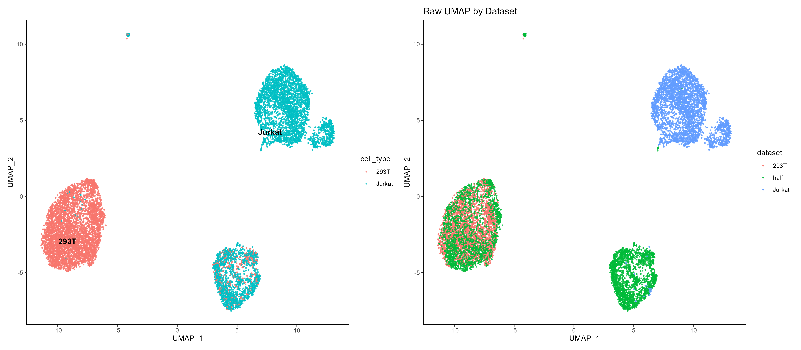 
  <em>Raw data UMAP result of 239T_Jurkat</em>  

  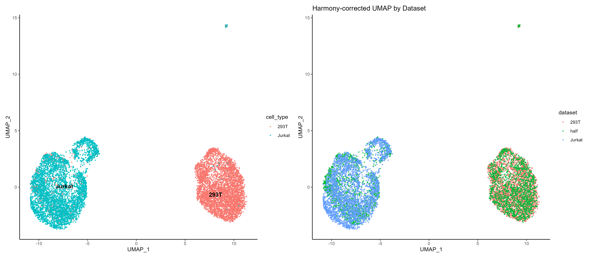 
  <em>Harmony UMAP result of 239T_Jurkat</em>  

  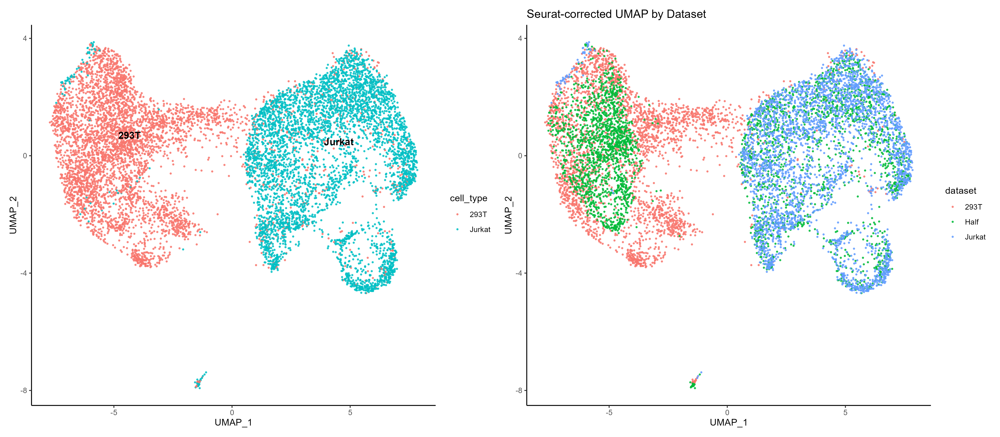 
  <em>Seurat UMAP result of 239T_Jurkat</em>  

  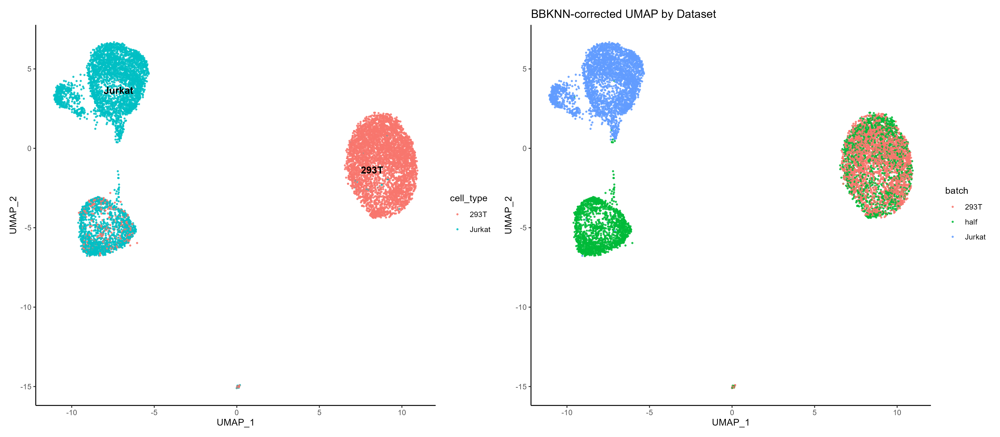 
  <em>BBKNN UMAP result of 239T_Jurkat</em>

  

***

### The result of each tool on panc8 dataset

  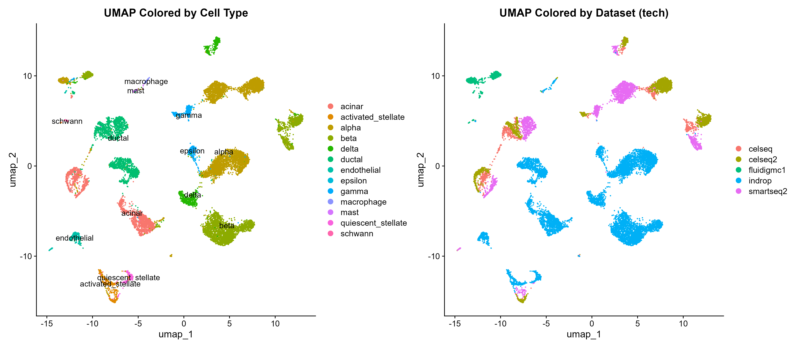 
  <em>Raw data UMAP result of panc8</em>  

  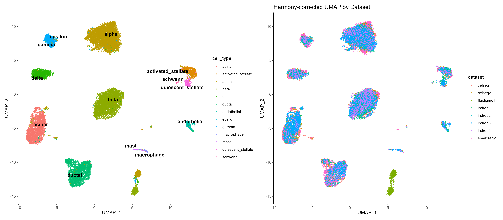 
  <em>Harmony UMAP result of panc8</em>  

  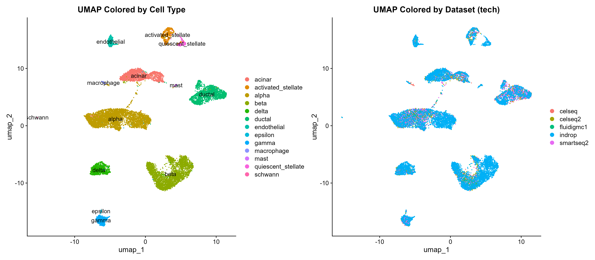 
  <em>Seurat UMAP result of panc8</em>  

  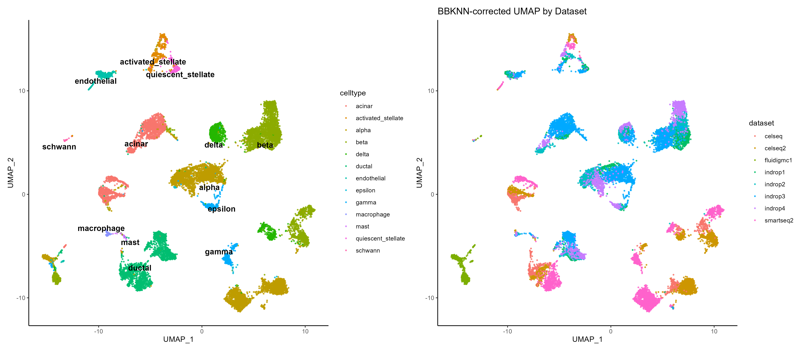 
  <em>BBKNN UMAP result of panc8</em>

  

***

### The result of each tool on cross-species dataset

  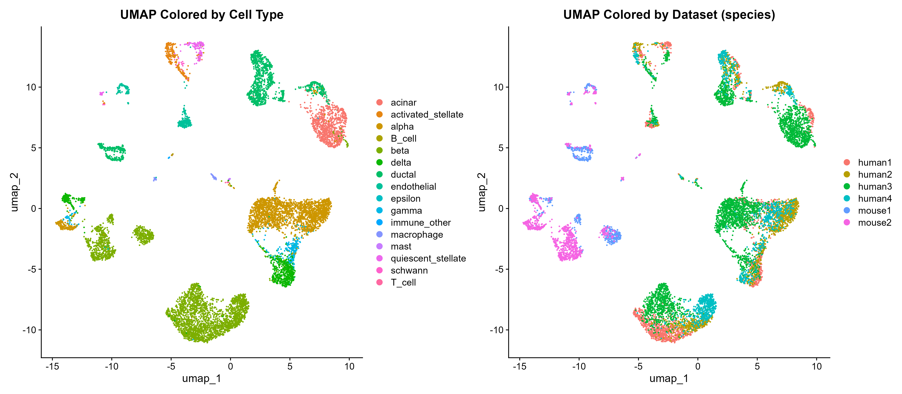 
  <em>Raw data UMAP result of cross-species dataset</em>  

  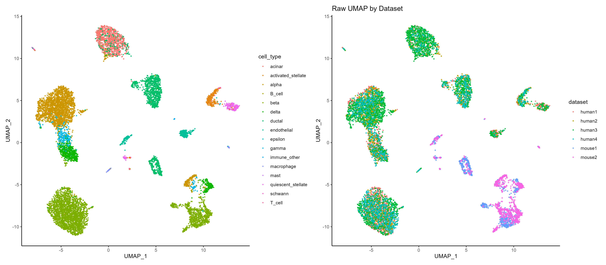 
  <em>Harmony UMAP result of cross-species dataset</em>  

  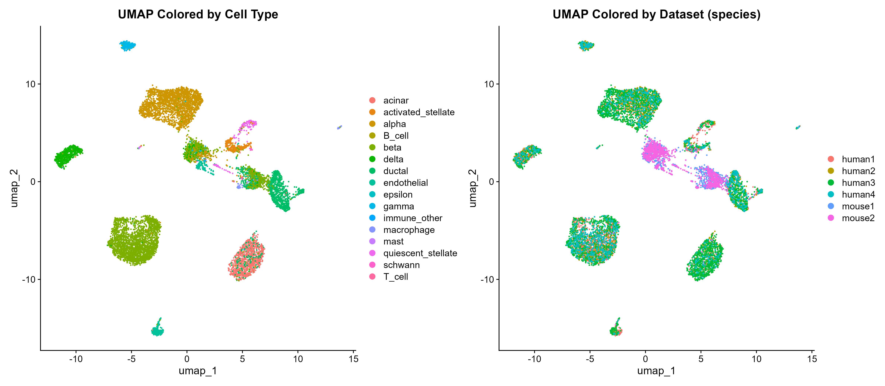 
  <em>Seurat CCA UMAP result of cross-species dataset</em>  

  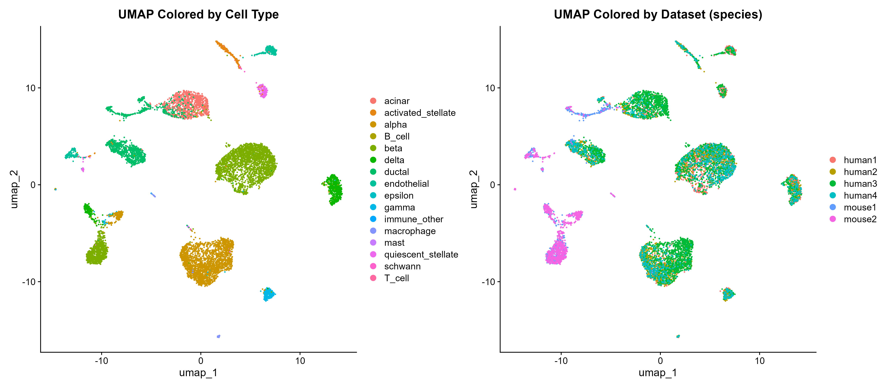 
  <em>Seurat RPCA UMAP result of cross-species dataset</em>

